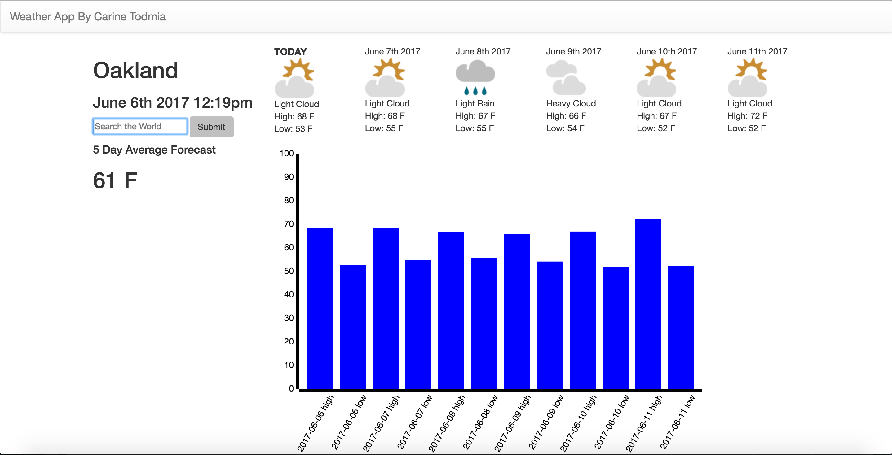

# weatherapi
A weather application provides the average forecast for a 5-day period

To use the application, perform the following: 
```sh
download/clone the repo
cd into the directory
npm install
npm start
localhost:8081
```
